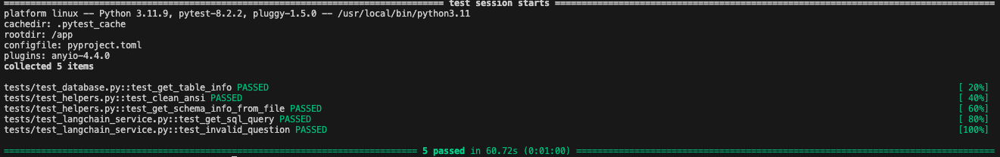

# Text-2-SQL System
## Built by

[ro-anderson](https://github.com/ro-anderson) | [LinkedIn](https://www.linkedin.com/in/ro-anderson/)


## What is this project?

This project aims to implement text-to-SQL technique through Python, LangChain, and Streamlit. It allows users to input natural language questions and receive corresponding SQL queries and results.

## Requirements

- Docker
- Docker Compose

## How to run?
> **Warning**: This project was entirely built and tested inside Docker. Running it locally without Docker may lead to unexpected issues or errors. The system may not work correctly if you try to run it outside of the Docker environment.

### Using Docker

1. Create a `.env` file from `.dev.env`:

```bash
cp .dev.env .env
```

2. Edit the `.env` file and fill in the required values:

```bash
OPENAI_API_KEY=""
DB_HOST=""
DB_USER=""
DB_PASSWORD=""
DB_NAME=""
```

3. Build and run the project using Make:

```bash
make run
```

   * This command will build the Docker image (if needed) and start the Streamlit app.

4. The server will be running at:

**http://localhost:8501/**


## Additional Make Commands

- `make build`: Build the Docker images
- `make test`: Run tests in Docker
- `make clean`: Remove Python cache files
- `make docker-clean`: Remove Docker containers, networks, and volumes
- `make help`: Display all available make commands

## Running Tests

This project includes a suite of unit tests to ensure the reliability and correctness of the code. To run the tests, use the following command:

```bash
make test
```

This command will build the Docker image (if needed) and run the tests inside a Docker container. 

The tests are executed using pytest with verbose output for detailed information about each test case.

Here's an example of what the test output looks like:




